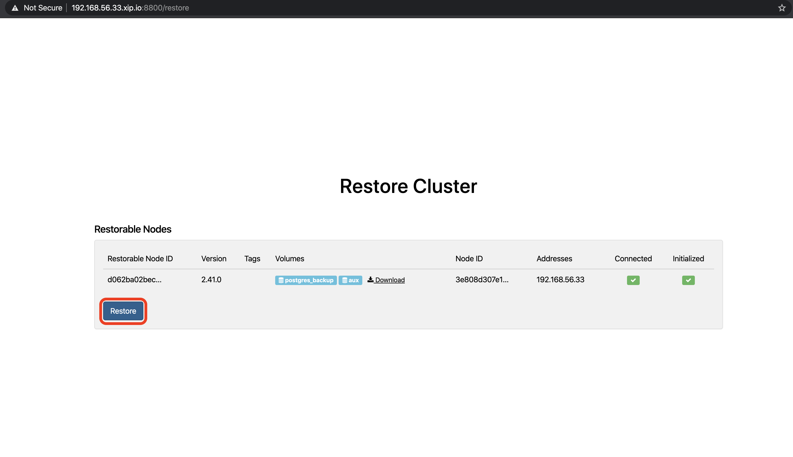

# PTFEv4 Basic Installation

Instructions on how to perform basic installation of PTFEv4 using [Replicated](https://www.replicated.com/index.html) package. 

The guide describes how to perform a Demo installation of PTFEv4 - all application services e.g. Terraform app, PostgreSQL, Vault etc. are running on a single machine.

# General

Overview of installation steps:

1. Create a machine that satisfies the PTFE [requirements](https://www.terraform.io/docs/enterprise/before-installing/index.html#linux-instance).
2. Install docker and [`Replicated`](https://www.replicated.com/index.html).
3. From the `Replicated` console Install PTFEv4 using the a `Replicated` installation package. Can install a fresh PTFEv4 instance or restore from a replicated snapshot.

# Detailed installation steps

In this section the general steps are described in more details.

## Host Machine

In the project root there is Vagrantfile that defines a suitable VM. To use it:

1. Install VirtualBox
2. Install Vagrant
3. Run `vagrant up` to build the VM
4. Run `vagrant ssh` to connect to the VM

The guide is based on this Vagrant project in the root of the repository.

## Install Docker and Replicated

To install Docker and Replicated can use the following bash [script](https://install.terraform.io/ptfe/stable).

On the VM run `curl https://install.terraform.io/ptfe/stable | sudo bash` and follow the script instructions.

1. Select the private IP address of the machine. Use `192.168.56.33`.
2. Select the service IP address. Leave blank.
3. Set a proxy if needed. Leave blank.

## Installing PTFE via Replicated

1. Open replicated admin console on http://<machine_address>:8800 . If using the Vagrant project `http://192.168.56.33:8800`. Bypass any TLS security warnings. When the webpage is opened Replicated will offer to set up a Hostname and TLS certificate for its admin console.

For the purpose of the demo set up `192.168.56.33.xip.io` as hostname and choose `Use Self-Signed Cert`. 

**Note**: Because of the self signed certificate you'll need to bypass the browser TLS security warning every time you access the replicated console.

2. On the next screen the Replicated console will ask to upload the license file for your PTFE installation if performing a fresh install or of you'd like to restore from existing snapshot.

Use the `Choose License` button and upload your license.

3. Next you need to specify the installation method

    * Online - Replicated will download and use the latest PTFE package.
    * Airgiapped - you can supply a package for Replicated to use.

Choose `Online` for the demo and press `Continue`.

4. On the following page you cаn secure access to the Replicated console. Can choose:

    * Anonymous - no restrictions.
    * Password - use a single password to access the console.
    * LDAP - authenticate via existing directory service.

For the Demo choose `Password`, enter a password e.g. `Password123#` and press `Continue`.

5. Next Replicated will perform OS and hardware requirements check.

When finished press `Continue`.

6. On the next screen you need to setup PTFE installation itself.

Set up an `Encryption Password` e.g. `Password123#` and choose `Demo` for `Installation Type`. This will install all services needed for the PTFE application on the current machine.

7. Next the Replicated dashboard is opened. On it you will see a progress indication for the PTFE startup. Once it is finished you will see the following screen:

## Taking and restoring from snapshots

The replicated console allows to take snapshots of the current PTFE instance and restore from them when needed.

### Taking a snapshot

1. Open the Replicated dashboard. If running this Demo should be at `https://192.168.56.33.xip.io:8800/dashboard`.
2. Press the `Start Snapshot` button and a snapshot will be taken. If using the default Replicated console settings (running this Demo) it will be placed in `/var/lib/replicated/snapshots` on the machine running Replicated.

### Restoring from a snapshot

It is possible to perform the Replaicated based PTFE installation by restoring PTFE from a previously taken snapshot.

**Note:** This repo includes a script `delete_all.sh` that will remove the currently installed PTFE on the Vagrant machine. If you'd like to test the snapshot restoration run `sudo /vagrant/delete_all.sh` on the Vagrant machine. It will remove the replicated installation and keep the snapshots taken in `/var/lib/replicated/snapshots`.

1. Follow the Replicated installation steps until you get to [Installing PTFE via Replicated, step 2](#installing-ptfe-via-replicated). 
2. On that click on `restore from snapshot` instead of uploading the license. 
3. On the next screen you can enter the snapshot location (leave as it is if running this Demo) and click on `Browse snapshots` button to display all available snapshots.

Click on the `restore` button next to the snapshot you would like to use for restore.

This will start the restore process. 

4. It may ask you to authenticate to the Replicated console using the method set in instance from which the snapshot was taken from.
5. The process will then go through the OS and hardware check list.
6. On the nest screen you will see the cluster that is being restored.

Click on the `Restore` button.

1. Next you will be taken to the Replicated console's cluster section. You can go to the Dashboard section to follow up on the PTFE installation/startup process.

