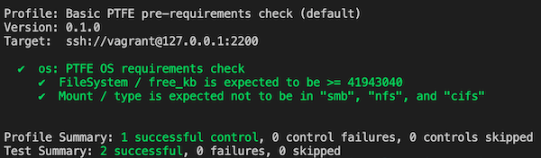

# Testing a Vagrant box with Kitchen CI

The repository includes a Kitchen test that can be used ot test if a Vagrant box meets the PTFE installation requirements.

## Prerequisites

* Have VirtualBox installed
* Have Vagrant installed
* Have ruby `~> 2.6.5` installed. Can use a ruby versions manager like [rbenv](https://github.com/rbenv/rbenv).
* Have `bundler` gem installed. To install:
  
  ```BASH
  gem install bundler
  ```

* Have the gems defined in the `Gemfile` installed. Can be installed using bundler:

  ```BASH
  bundle install
  ```

## Configuring the test

Set the Vagrant box you want to check as a value for key `driver.box` in the `.kitchen.yml` file. For example:

```YML
driver:
# ...
  box: slavrd/bionic64
# ...
```

## Running the test

* Build the testing environment
  
  ```BASH
  bundle exec kitchen converge
  ```
* Run the tests

  ```BASH
  bundle exec kitchen verify
  ```

  If tests pass you should see output similar to the below:

  

* Destroy the testing environment

  ```BASH
  bundle exec kitchen destroy
  ```  
